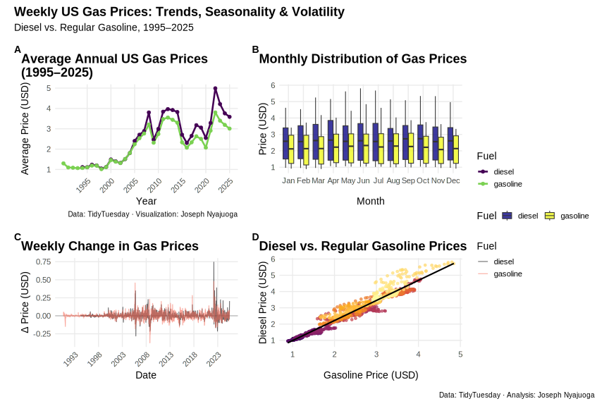
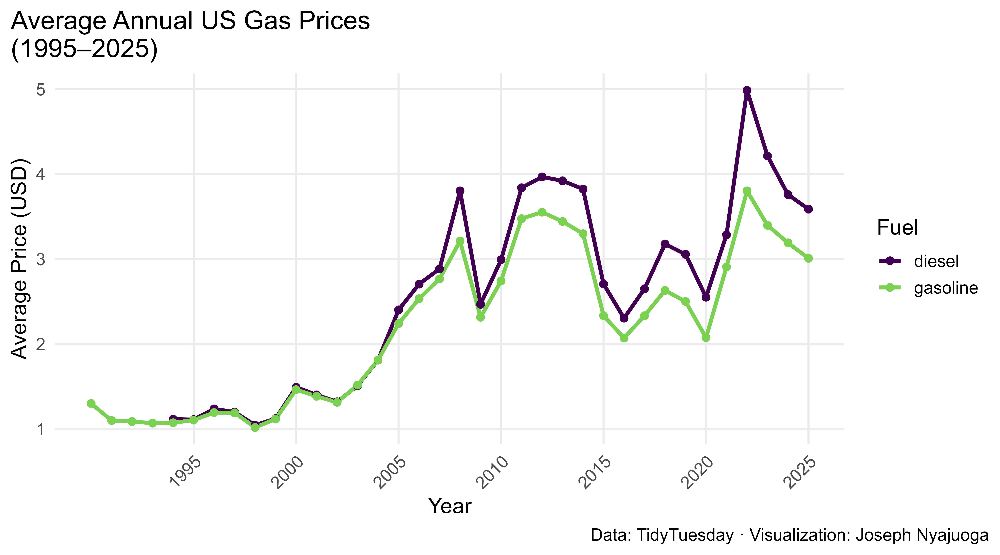
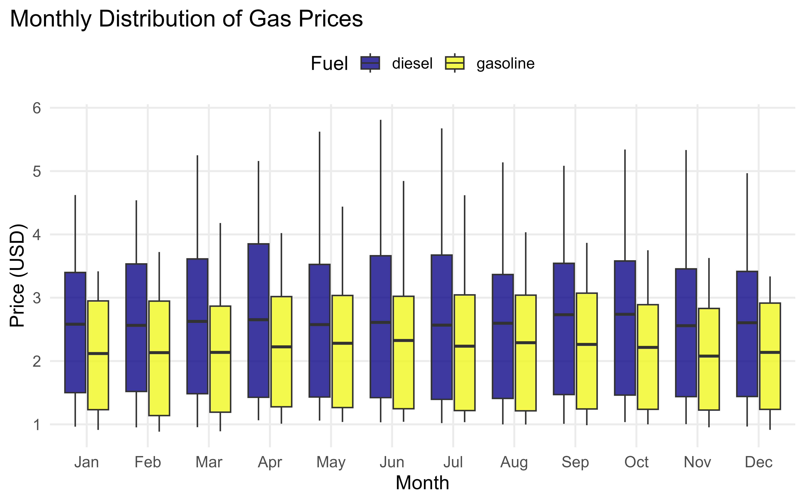
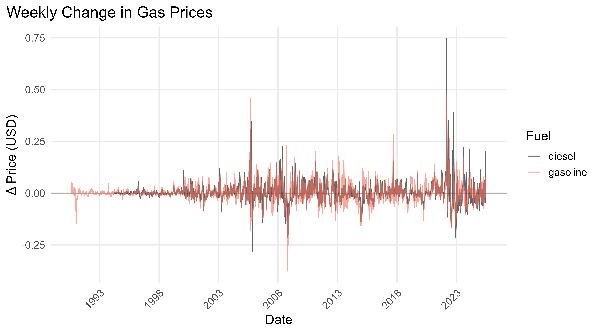
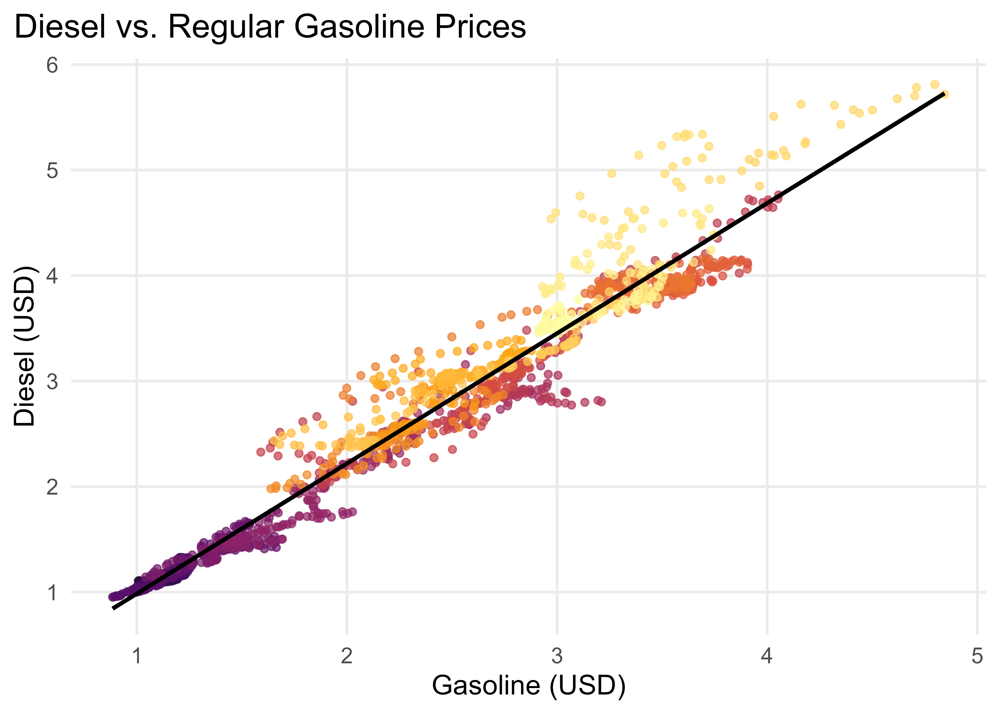

# Weekly US Gas Prices Visualization - TidyTuesday

[](https://cran.r-project.org/)
[](https://github.com/rfordatascience/tidytuesday)
[](LICENSE)

A Quarto‐ and Shiny‐based exploration of weekly U.S. retail gas prices (diesel & regular gasoline) from 1995 through 2025. This repo contains both a static Quarto notebook (`gasprice.qmd`) producing a multi‐panel summary dashboard, and a fully interactive Shiny app (`app.R`) for ad‐hoc filtering and plotting.

---

## 🚀 Features

1. **Static Quarto Dashboard** (`gasprice.qmd` → `gasprice.html`)  
   - **Average Annual Prices**: line plots of mean diesel vs. gasoline by year  
   - **Seasonal Distribution**: boxplots showing monthly price variation  
   - **Weekly Volatility**: time series of week-to-week price changes (Δ USD)  
   - **Fuel Correlation**: scatter plot & linear fit of gasoline vs. diesel prices  
   - **Combined Layout**: all four plots arranged into a polished grid

2. **Interactive Shiny App** (`app.R`)  
   - Filter by **fuel type** (diesel / gasoline)  
   - Select a **custom date range**  
   - Choose among four plot modes (“Annual Trend”, “Seasonality”, “Volatility”, “Correlation”)  
   - Instant re‐rendering without re‐deploying or restarting

---

## 📊 Data Source

All data are pulled directly from the TidyTuesday repository:  
https://github.com/rfordatascience/tidytuesday/tree/main/data/2025/2025-07-01

Specifically the file:  
`weekly_gas_prices.csv`

---

## 🖼️ Sample Visualizations

Below are example outputs generated by this project:

<p align="center">
  
</p>

<p align="center">
  
  
</p>

<p align="center">
  
  
</p>

---

## 📁 Repository Structure

```plaintext
USgasvisualization/
├── .gitignore                # Untracked files & folders
├── README.md                 # This file
├── gasprice.qmd              # Quarto notebook (static analysis + visuals)
├── gasprice.html             # Rendered output of gasprice.qmd
├── app.R                     # Shiny application
├── images/
│   ├── annual_avg_prices.png
│   ├── diesel_vs_gasoline.png
│   ├── final_2x2_grid.svg
│   ├── monthly_boxplot.png
│   └── weekly_changes.png
└── renv.lock                 # Lockfile for reproducible R dependencies
```
---
## 🔧 Setup & Installation

**1. Clone the repo**

```bash
git clone https://github.com/joseph-data/USgasvisualization.git
cd USgasvisualization
```
**2. R environment setup**

*(Optional)* Activate your project library with `renv`:
```r
renv::activate()
renv::restore()
```

OR install packages into your user library:

```r
install.packages(c(
  "quarto",     # if using Quarto from R
  "shiny",
  "tidyverse",  # includes dplyr, ggplot2, readr, etc.
  "lubridate",
  "scales",
  "viridis",
  "patchwork"
))
```
---
## ▶️ Usage

**1. Render the Static Dashboard**  
From the command line:

```bash
quarto render gasprice.qmd
```

Then open `gasprice.html` in your browser.

**2. Launch the Interactive Shiny App**

In R or RStudio, run:
```r
shiny::runApp("app.R")
```
---

## 📬 Contact

[](https://github.com/joseph-data)

For questions or suggestions, please open an issue or reach out via [GitHub profile](https://github.com/joseph-data).

---
